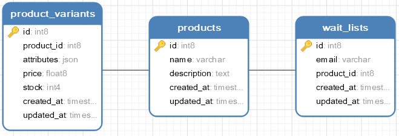

# Technical test for back-end profile(Laravel)

## To run in local


* In the project root directory run
```
$ composer install
$ php artisan migrate --seed
$ php artisan serve
```

* To manage the jobs on local open a new terminal and run
```
$ php rtisn queue:work
```

## To run the tests
```
$ php vendor/bin/phpunit
```

## Available endpoints

### Get all products

```
GET api/products
```

**Query Example**
```
curl --location --request GET '/api/products
```

**Response Example**
```json
{
    "success": true,
    "data": [
        {
            "id": 120,
            "name": "pc",
            "description": "dell",
            "created_at": null,
            "updated_at": null,
            "lowest_price_variation": {
                "id": 102,
                "product_id": 120,
                "attributes": "{\"color\":\"green\"}",
                "price": "250",
                "stock": 0,
                "created_at": null,
                "updated_at": null
            }
        },
        {
            "id": 1201,
            "name": "laptop",
            "description": "hp",
            "created_at": null,
            "updated_at": null,
            "lowest_price_variation": {
                "id": 20,
                "product_id": 1201,
                "attributes": "{\"color\":\"black\",\"size\":\"43\"}",
                "price": "2500",
                "stock": 2,
                "created_at": "2021-12-12T12:26:14.000000Z",
                "updated_at": "2021-12-12T12:26:14.000000Z"
            }
        },
    ],
    "message": "Products retrieved successfully"
}
```
#### Available Filters
* `minPrice` *type: float*  
   Returns products, and the respective variants with prices above the minPrice value.


* `maxPrice` *type: float*  
  Returns products, and the respective variants with prices under the maxPrice value.


* `inStock` *type: boolean*  
  If true returns products, and the respective variants with stock higher than 0. If is false returns the ones with stock equals to 0.


*  `name`  *type: string*  
    Returns all products that the name attribute contains the given value.  


*  `description`  *type: string*  
   Returns all products that the description attribute contains the given value.


#### Filter by attributes
The default attributes are `color` and `size` if you add a custom attribute you can filter by that attribute name as well. 

*  `attributeName`  *type: string*  
   Returns all products, and the respective variants that the json attributes field contains the given value.

**Query example**
```
curl --location --request GET '/api/products?color=blue&size=43'
```

**Response Example**
```json
{
    "success": true,
    "data": [
        {
            "id": 21,
            "name": "laptop i5 4gb",
            "description": "hp",
            "created_at": "2021-12-12T16:01:41.000000Z",
            "updated_at": "2021-12-12T16:01:41.000000Z",
            "variants": [
                {
                    "id": 22,
                    "product_id": 21,
                    "attributes": "{\"color\":\"blue\",\"size\":\"20\",\"in\":\"recusandae\"}",
                    "price": "2500",
                    "stock": 2,
                    "created_at": "2021-12-12T16:01:41.000000Z",
                    "updated_at": "2021-12-12T16:01:41.000000Z"
                }
            ]
        },
    ],
    "message": "Products retrieved successfully"
}
```

### Create a new product

Required attributes
* `name`        *type: string*  
* `description` *type: string*  
* `attributes`  *type: json*  
* `price`       *type: float*
* `stock`       *type: integer*

**Endpoint**
```
POST /api/products
```

**Query example**
```
curl --location --request POST '/api/products' 
--header 'Content-Type: application/x-www-form-urlencoded' 
--data-urlencode 'name=laptop' 
--data-urlencode 'description=hp' 
--data-urlencode 'price=200' 
--data-urlencode 'attributes={"color":"black","size":"43","in":"recusandae"}' 
--data-urlencode 'stock=2'
```

**Response example**
```json
{
    "success": true,
    "data": {
        "name": "dummy name",
        "description": "dummy description",
        "updated_at": "2021-12-12T16:01:41.000000Z",
        "created_at": "2021-12-12T16:01:41.000000Z",
        "id": 21,
        "variants": [
            {
                "id": 22,
                "product_id": 21,
                "attributes": "{\"color\":\"blue\",\"size\":\"43\"}",
                "price": "2500",
                "stock": 2,
                "created_at": "2021-12-12T16:01:41.000000Z",
                "updated_at": "2021-12-12T16:01:41.000000Z"
            }
        ]
    },
    "message": "Products saved successfully"
}
```

### Get product by id
Returns a product with all the project variants

**Query example**
```
GET /api/products/id
```

**Query example**
```
curl --location --request GET '/api/products/{id}'
```

**Response example**

```json
{
    "success": true,
    "data": {
        "id": 120,
        "name": "dummy data",
        "description": "dummy description",
        "created_at": null,
        "updated_at": null,
        "variants": [
            {
                "id": 101,
                "product_id": 120,
                "attributes": "{\"color\":\"black\"}",
                "price": "300",
                "stock": 3,
                "created_at": null,
                "updated_at": null
            },
            {
                "id": 102,
                "product_id": 120,
                "attributes": "{\"color\":\"green\"}",
                "price": "250",
                "stock": 0,
                "created_at": null,
                "updated_at": null
            }
        ]
    },
    "message": "Products retrieved successfully"
}
```

###  Update an existing product
Updates a product name and description.

Required attributes
* `name`        *type: string*
* `description` *type: string*

To update a product variant include the variant id as `variantId` 
* `attributes`  *type: json*
* `price`       *type: float*
* `stock`       *type: integer*

**Endpoint**
```
PATCH /api/products/id
```

**Query Example**

```
curl --location --request PATCH '/api/products/{id}' 
--header 'Content-Type: application/x-www-form-urlencoded' 
--data-urlencode 'name=laptop i5 4gb' 
--data-urlencode 'description=hp' 
--data-urlencode 'price=2500' 
--data-urlencode 'attributes={"color":"black","size":"43","in":"recusandae"}' 
--data-urlencode 'stock=2' 
--data-urlencode 'variantId=6'
```

**Response example**

```json
"success": true,
    "data": {
        "id": 6,
        "name": "laptop i5 4gb",
        "description": "hp",
        "created_at": "2021-12-12T05:42:07.000000Z",
        "updated_at": "2021-12-12T06:39:36.000000Z",
        "variants": [
            {
                "id": 6,
                "product_id": 6,
                "attributes": "{\"color\":\"black\",\"size\":\"43\",\"in\":\"recusandae\"}",
                "price": "2500",
                "stock": 2,
                "created_at": "2021-12-12T05:42:08.000000Z",
                "updated_at": "2021-12-12T06:40:29.000000Z"
            }
        ]
    },
    "message": "Products updated successfully"
}
```

### Delete a product an all the variants

**Endpoint**
```
DELETE /api/products/id
```

**Query Example**
```
curl --location --request DELETE '/api/products/{id}'
```

**Response example**
```json
{
    "success": true,
    "message": "Products deleted successfully"
}
```

###  Subscribe to a product
Required attributes
* `email` user email
* `product_id` an existent product id

**Endpoint**
```
/api/products/subscribe
```

**Query Example**
```
curl --location --request POST '/api/products/subscribe' 
--header 'Content-Type: application/x-www-form-urlencoded' 
--data-urlencode 'product_id=8' 
--data-urlencode 'email=dummy@example.com'
```

**Response example**
```json
{
    "success": true,
    "message": "You have been subscribed successfully"
}
```

###  Add a product variation
Required attributes
* `email` user email
* `product_id` an existent product id

**Endpoint**
```
/api/products/{products}/product_variant
```

**Query Example**
```
curl --location --request POST '/api/products/{product_id}/product_variant' \
--header 'Content-Type: application/x-www-form-urlencoded' \
--data-urlencode 'price=2500' \
--data-urlencode 'attributes={"color":"blue","size":"43","in":"recusandae"}' \
--data-urlencode 'stock=2'
```

**Response Example**
```json
{
    "success": true,
    "data": {
        "attributes": "{\"color\":\"blue\",\"size\":\"43\"}",
        "price": "2500",
        "stock": "2",
        "product_id": 6,
        "updated_at": "2021-12-12T16:17:32.000000Z",
        "created_at": "2021-12-12T16:17:32.000000Z",
        "id": 23,
        "product": {
            "id": 6,
            "name": "laptop i5 4gb",
            "description": "hp",
            "created_at": "2021-12-12T05:42:07.000000Z",
            "updated_at": "2021-12-12T06:39:36.000000Z"
        }
    },
    "message": "Product Variant saved successfully"
}
```

###  Delete a product variation
Required attributes
* `email` user email
* `product_id` an existent product id

**Endpoint**
```
/api/products/product_variant
```

**Query Example**
```
curl --location --request DELETE '/api/products/product_variant/{id}'
```

**Response Example**
```json
{
    "success": true,
    "message": "Product Variant deleted successfully"
}
```

You can't subscribe to a product if the product stock is bigger than 0, any attempt will return 
```json
{
    "success": false,
    "message": "You cannot subscribe to a product that is already on existence"
}
```


## Database structure

    
